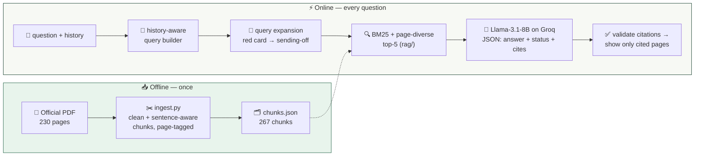

<div align="center">

# ⚽ Asking the Rulebook
### A RAG chatbot for the FIFA/IFAB Laws of the Game 2025/26

[](https://fifa-rag.vercel.app)
[](https://python.org)
[](https://fastapi.tiangolo.com)
[](https://groq.com)
[-D8A511?style=for-the-badge)](#-evaluation-results)

Ask football-rules questions in plain language — get answers drawn from the
official rulebook, **with page citations you can check against the source**.

*"What happens after a red card?" → answered from the actual Laws, citing [p. 117]*

</div>

> ⚠️ **Educational project — not affiliated with or endorsed by FIFA or IFAB.**
> This is a student NLP project. Answers can be incomplete or wrong; always check
> the official Laws of the Game before relying on a rule.

---

## 👥 Group members

* **Virginia Spolaore**
* **Harish Bhavandla**
* **Eren Yon**

Built for the NLP with LLMs final project · June 2026.

## 🎯 Problem framing

Football's rulebook is long, legalistic, and frequently misremembered. We built a
chatbot that answers natural-language rules questions **only from the official
document**, attaching page citations so answers can be checked against the source.

The core NLP problem is the **register gap**: users ask in colloquial football
language ("red card", "stoppage time") while the corpus is written in precise
legal terminology ("sending-off offence", "additional time allowance"). Bridging
that gap drives both our design and our evaluation.

## 📚 Corpus provenance and scope

| | |
|---|---|
| Document | **Laws of the Game 2025/26** (single-pages edition) |
| Publisher / rights holder | The International Football Association Board (IFAB) / FIFA |
| Official source | [downloads.theifab.com — Laws of the Game 2025/26 (single pages)](https://downloads.theifab.com/downloads/laws-of-the-game-2025-26-single-pages?l=en) · [IFAB documents](https://www.theifab.com/documents/) |
| Accessed | 2026-06-13 |
| Source PDF | 230 pages; SHA-256 in [`data/source_metadata.json`](data/source_metadata.json) |
| Indexed corpus | **267 chunks** spanning PDF pages **4–217** (text pages only) |

The document is **not authored by us**; rights remain with IFAB/FIFA. The source
booklet's notice restricts reproduction, and we have **not** obtained permission.
`data/chunks.json` is a **derived, preprocessed research artifact** for this
educational project, not the official document, and confers no rights. The
**source PDF is not committed**. To reproduce the corpus, download the official
PDF and run ingestion yourself (see [Reproducibility](#-reproducibility)). Full
details and the copyright notice are in [`data/source_metadata.json`](data/source_metadata.json).

## 🏗️ Architecture



Retrieval lives in the reusable **`rag/`** package, which the web API, the
evaluation harness, the notebook and the tests all import — so they cannot
diverge.

## 🚀 Quick start

### What you need

| Requirement | Check with | Get it from |
|---|---|---|
| Python 3.10–3.12 | `python3 --version` | [python.org/downloads](https://python.org/downloads) |
| A free Groq API key (for generation only) | — | [console.groq.com/keys](https://console.groq.com/keys) |

> 💡 **Windows:** use `python` instead of `python3`.

```bash
git clone https://github.com/harish885/fifa-rag-chatbot.git
cd fifa-rag-chatbot
python3 -m pip install -r requirements-dev.txt   # full dev/repro environment
cp .env.example .env                             # then paste your key into .env
python3 local_server.py                          # → http://localhost:8000
```

`requirements.txt` is the **lean deployment set** (what Vercel installs);
`requirements-dev.txt` adds ingestion, notebook, test and audit tooling.

### Environment variables

See [`.env.example`](.env.example). `.env` is git-ignored.

| Variable | Required | Default |
|---|---|---|
| `GROQ_API_KEY` | for generation | — |
| `GROQ_MODEL` | no | `llama-3.1-8b-instant` |
| `RAG_TOP_K`, `RAG_DEDUPLICATE_PAGES`, … | no | see [`rag/config.py`](rag/config.py) |

### Commands

```bash
python3 eval/evaluate.py            # retrieval evaluation (no key) → eval/results.json
python3 eval/evaluate_answers.py    # answer-eval retrieval + annotation template (no key)
python3 -m pytest                   # 77 tests (no key; Groq is mocked)
jupyter notebook walkthrough.ipynb  # end-to-end walkthrough
```

With `make`: `make install`, `make test`, `make evaluate`, `make run`,
`make reproduce`, `make audit`.

## 🧠 Design decisions (and alternatives considered)

**🔍 Retrieval: BM25 + token-boundary query expansion, with page-diverse top-5.**
- *Why lexical:* the corpus is a single terminology-dense rulebook where exact
  terms carry most of the signal; BM25 is fully interpretable (scores decompose
  into term contributions), which made the error analysis below possible; and it
  builds from JSON at cold start with no ML model to download.
- *Trade-off, not a verdict:* dense retrieval (sentence-transformers + a vector
  index) can capture paraphrase that BM25 misses. We chose lexical retrieval for
  **simplicity, interpretability, small corpus size (267 chunks), and the
  free/serverless deployment target** — not because dense retrieval "cannot
  work" here. We did not benchmark a dense retriever; that remains future work.
- *Query expansion* maps colloquial phrases to official terminology with
  **word-boundary matching** (so "keeper" does not fire inside "goalkeeper", and
  "var" does not fire inside other words). Provenance of each map entry
  (glossary-derived vs development-motivated) is documented in
  [`rag/expansion.py`](rag/expansion.py).
- *Page-diverse top-5:* we keep the highest-scoring chunk per page so the five
  results cover up to five distinct pages, instead of wasting context on
  duplicate pages. This is logically justified for context efficiency; see the
  measured effect below.

**🧵 History-aware retrieval.** A deterministic query builder detects referential
follow-ups ("What are the exceptions?") and prepends the most recent **user**
turn's subject, so retrieval stays on topic. No LLM, no key — the offline
evaluation never depends on a network call. See [`rag/conversation.py`](rag/conversation.py).

**🤖 Generation: `llama-3.1-8b-instant` on Groq (configurable via `GROQ_MODEL`).**
- The model returns a JSON envelope (`answer` + `status` + `cited_pages`) at
  temperature 0. The system prompt forbids answering outside the provided context
  and requires page citations. We chose an 8B model because it is fast and free
  for this paraphrase-from-context task; we have **not** compared it against a
  larger model, so we make no claim that 8B is optimal or that a larger generator
  would not help — that comparison is future work.
- *Rejected — fine-tuning an LLM on the Laws:* expensive, freezes the model to one
  edition, and provides no citations; RAG lets us swap in a new edition by
  re-running one script.

**☁️ Deployment: Vercel serverless (FastAPI) + a single HTML frontend.** No
database, no background workers. This constraint shaped the retrieval choice.

## 📏 Quantitative methodology (retrieval)

We hand-labelled **20 natural-language questions** with the gold PDF page(s)
containing the answer (`eval/eval_set.json`, dataset `laws_dev_v1`).

**Metric — Page Hit Rate@k (`hit@k`):** a query is a *hit at k* when at least one
of the top-k retrieved chunks comes from a page labelled as containing the
answer. **This is not information-retrieval recall.** We also report page-level
MRR@5 and the mean number of unique pages in the top-5, with 95% Wilson
confidence intervals on `hit@5`.

**This 20-question set is a development set, not a held-out test set.** It was
used for error analysis and to develop the query-expansion map, so its numbers
are **optimistic**, not unbiased test performance. A documented protocol for a
genuinely held-out set (written by someone who did not tune the map, double-
annotated, frozen before evaluation) is in [`eval/README.md`](eval/README.md).

**Limitations of the metric:** the correct page does not guarantee the chunk
contains the answer span; page labels are coarse; each query gets one binary
value; it does not measure answer correctness.

## 🔬 Qualitative / answer-level methodology

Retrieval hit rate does **not** establish answer correctness, so
[`eval/evaluate_answers.py`](eval/evaluate_answers.py) adds an answer-level
harness over in-domain, out-of-domain, ambiguous and follow-up items. Scoring is
**human and authoritative** (rubric: correctness, faithfulness, citation
correctness/completeness, refusal behaviour — see [`eval/README.md`](eval/README.md)).
Deterministic, key-free **citation checks** run automatically: extract `[p. N]`
citations, confirm each cited page was actually retrieved, and flag substantive
answers with no citation. **Human answer scores are pending human evaluation and
have not been fabricated.**

## 📊 Evaluation results

Run on the regenerated 267-chunk corpus, 20 development queries, k=5
(`eval/results.json`). **Numbers below are development-set performance.**

| System | hit@1 | hit@3 | hit@5 | page-MRR@5 | unique pages@5 |
|---|:-:|:-:|:-:|:-:|:-:|
| 🥇 **BM25 + expansion + page-dedup (production)** | 0.45 | 0.60 | **0.75** (15/20) | **0.55** | **5.0** |
| BM25 + expansion, chunk-level (no dedup) | 0.45 | 0.60 | 0.75 | 0.55 | 4.45 |
| BM25 plain + page-dedup (no expansion) | 0.45 | 0.60 | 0.65 | 0.53 | 5.0 |
| TF-IDF cosine (baseline) | 0.30 | 0.50 | 0.55 | 0.40 | 4.65 |
| Random (floor) | 0.05 | 0.05 | 0.05 | 0.05 | 5.0 |

**95% Wilson CI on production hit@5:** [0.53, 0.89] — with n=20 the interval is
wide; this is a small sample and a CI is **not** evidence of generalization.

**Interpretation:**
- **Query expansion** adds **+0.10 hit@5** (0.65 → 0.75) with **no regressions**.
  Query by query, expansion *changed the outcome* of two queries (the "red card"
  and "how long does a match last" questions, which became hits) and **fired
  without changing the outcome** on several others (some were already hits; the
  "yellow card" and "extra time" queries still miss despite expansion). We do not
  claim it "fixed exactly the failures".
- **Page deduplication** does not change hit@5 on this set but raises mean unique
  pages from **4.45 → 5.0**, i.e. it removes wasted duplicate-page context. We
  adopt it for that conceptual reason, reporting both the justification and the
  (neutral) measured hit effect rather than tuning to the development set.
- These gains are measured on the **development set** and are optimistic.

## 🐛 Error analysis (5/20 production misses, from `eval/results.json`)

Per-query, the misses fall into distinct categories (observed, not assumed):

- **Front-matter collision** — *"cautionable offences (yellow card)"* retrieves
  pages 18/28/30/31 (Notes & modifications front matter) over Law 12. Proposed
  (not yet implemented) mitigation: down-weight or exclude front-matter pages.
- **Domain-adjacent confusion** — *"periods of extra time"* retrieves the
  half-time/duration page 87 instead of the extra-time page 97.
- **Low-information query** — *"When is a goal scored?"* has few content words,
  both very frequent in the corpus.
- **Specific-provision dilution** — *"where must the goalkeeper stand during a
  penalty kick"* and *"defensive wall distance at a free kick"*: the gold page
  exists but the specific chunk is outranked by other law text.

These are **per-query observations**; they are not all one cause, and the
mitigations above are proposals, not completed work.

## 🔁 Reproducibility

**Fully offline (no key):** tests, retrieval evaluation, the answer-eval
retrieval/annotation template, and the regression check
(`python eval/check_regression.py`).

**Needs `GROQ_API_KEY`:** answer generation (the live chat and
`eval/evaluate_answers.py --generate`).

**Regenerating the corpus needs the PDF:** the source PDF is **not** committed.
Download it from the [official source](https://downloads.theifab.com/downloads/laws-of-the-game-2025-26-single-pages?l=en),
then:

```bash
python3 scripts/ingest.py "Laws of the Game 2025_26_single pages.pdf"
```

This rewrites `data/chunks.json` (267 chunks; verify against the SHA-256 in
`data/source_metadata.json`). The committed `data/chunks.json` is a **prebuilt
artifact** so the app and evaluation run without the PDF.

**Notebook:** `walkthrough.ipynb` runs end-to-end from the committed
`chunks.json`. The generation cell **skips cleanly when `GROQ_API_KEY` is unset**
— meaning the committed notebook does not by itself reproduce an LLM answer; run
it with a key to see generation.

Tested on **Python 3.10 and 3.12** (see [`.github/workflows/ci.yml`](.github/workflows/ci.yml)).

## ☁️ Deployment

Vercel serverless (Python runtime). Per the [official Vercel limits](https://vercel.com/docs/functions/limitations)
(reference page updated 2026-05-14), Python functions allow up to **500 MB**
uncompressed — our function is far smaller. The app **can run within Vercel's
free-tier allowances** and Groq's free tier, but quotas and pricing can change,
so we avoid an unqualified "$0" claim.

```bash
npx vercel --prod
echo "gsk_your_key" | npx vercel env add GROQ_API_KEY production
npx vercel --prod
```

## 🔒 Security & dependencies

`fastapi 0.115.x` resolved to **Starlette 0.46.2**, vulnerable to
**CVE-2026-48710** ("BadHost" host-header auth bypass), fixed in Starlette 1.0.1.
We pin **fastapi 0.136.3 + starlette ≥ 1.0.1** (resolves to 1.3.1).
`pip-audit -r requirements.txt` reports **no known vulnerabilities**. The API adds
typed request validation, bounded message/history limits, timeouts and retries
(transient errors only), security headers, and never logs the key or returns raw
upstream bodies. Rate limiting should be applied at the platform layer (Vercel) —
we do not ship an in-memory limiter that would be ineffective across serverless
instances.

## 📁 Repository structure

```
rag/                     ← reusable retrieval core (shared by API, eval, notebook, tests)
  config.py  text.py  expansion.py  bm25.py  retrieval.py  conversation.py  citations.py  models.py
api/index.py             ← FastAPI function: history-aware retrieval + Groq + citation-validated response
api/ui.html              ← chat frontend (bundled in the function)
public/index.html        ← identical UI for static serving (kept in sync; tests/test_ui_sync.py)
scripts/ingest.py        ← PDF → data/chunks.json (cleaning, sectioning, sentence-aware chunks)
data/chunks.json         ← 267 page-tagged chunks (prebuilt artifact)
data/source_metadata.json← corpus provenance, checksums, copyright notice
eval/evaluate.py         ← Page Hit Rate@k + MRR, 6-system comparison → results.json
eval/evaluate_answers.py ← answer-level harness + deterministic citation checks
eval/eval_set.json       ← laws_dev_v1 (development) — 20 labelled queries
eval/README.md           ← metric definitions, dev-vs-held-out protocol, rubric
tests/                   ← 77 tests (tokenization, expansion, BM25, retrieval, conversation, ingest, eval, API, UI sync)
walkthrough.ipynb        ← reproducible end-to-end notebook
local_server.py          ← run UI + API locally on :8000
laws_rag_presentation.pptx  ← project slide deck
.github/workflows/ci.yml ← tests + eval regression + notebook + pip-audit
```

## 🤝 AI usage

This project used **Claude (Anthropic)** in line with the course AI policy:
- **Infrastructure code (AI-assisted):** the ingestion script, the `rag/`
  retrieval core, the FastAPI backend, the frontend, the evaluation and
  answer-eval harnesses, the test suite and CI.
- **A production/academic hardening pass (AI-assisted, this revision):**
  refactoring retrieval into `rag/`, fixing the query-expansion substring bug and
  the conversational-retrieval bug, adding page-diverse retrieval, correcting the
  metric naming (Recall → Page Hit Rate), regenerating the corpus with cleaner
  ingestion, the security/dependency update, and rewriting this README, the
  notebook and the slide deck.
- **Human-required work (not done by AI):** writing and labelling the questions,
  the choice of corpus and problem framing, and **all human answer-level scoring
  and held-out labelling**, which remain the group's responsibility and are
  currently outstanding (see [`eval/README.md`](eval/README.md)).
- All quantitative numbers here were produced by the committed code; claims we
  could not measure are labelled as future work.

## 📖 References

- IFAB, *Laws of the Game 2025/26* — [official documents](https://www.theifab.com/documents/)
- [Vercel Functions limits](https://vercel.com/docs/functions/limitations) ·
  [Groq llama-3.1-8b-instant](https://console.groq.com/docs/model/llama-3.1-8b-instant)

---

<div align="center">

**⚽ Built for the NLP with LLMs final project · June 2026**

[Live demo](https://fifa-rag.vercel.app) · [Report an issue](../../issues)

</div>
