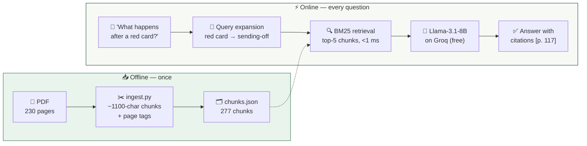

<div align="center">

# ⚽ Asking the Rulebook
### A RAG chatbot for the FIFA Laws of the Game 2025/26

[](https://fifa-rag.vercel.app)
[](https://python.org)
[](https://fastapi.tiangolo.com)
[](https://groq.com)
[](#-evaluation-results)

Ask anything about football rules in plain language — get answers grounded in the official 230-page rulebook, **with page citations you can verify**.

*"What happens after a red card?" → answered from the actual Laws, citing [p. 117]*

</div>

---

## 🚀 Quick start — run it on your machine in 5 minutes

### Step 0 — What you need

| Requirement | Check with | Get it from |
|---|---|---|
| Python 3.10+ | `python3 --version` | [python.org/downloads](https://python.org/downloads) |
| Git | `git --version` | [git-scm.com](https://git-scm.com) |
| A free Groq API key | — | [console.groq.com/keys](https://console.groq.com/keys) → sign up (free, 2 min) → "Create API Key" → copy it |

> 💡 **Windows users:** use `python` instead of `python3` everywhere below.

### Step 1 — Clone and enter the project

```bash
git clone https://github.com/harishbhavandla/fifa-rag-chatbot.git
cd fifa-rag-chatbot
```

### Step 2 — Install dependencies

```bash
python3 -m pip install -r requirements.txt uvicorn
```

### Step 3 — Add your Groq key

Create a file named `.env` in the project folder containing one line (paste **your** key):

```bash
echo "GROQ_API_KEY=gsk_your_key_here" > .env
```

### Step 4 — Start the chatbot

```bash
python3 local_server.py
```

You should see:

```
GROQ_API_KEY: set (gsk_xxxx…)
Chatbot running at http://localhost:8000
```

### Step 5 — Open it 🎉

Go to **http://localhost:8000** in your browser and ask: *"When is a player offside?"*

### 🔧 If something goes wrong

| Symptom | Fix |
|---|---|
| `command not found: python3` | Use `python` (Windows) or install Python |
| `GROQ_API_KEY: MISSING` | Your `.env` file is missing/misnamed — redo Step 3, make sure the file is in the project folder |
| `Address already in use` | Something else uses port 8000 — edit the last line of `local_server.py` to `port=8001` |
| Answer says "Groq API error 401" | Your key is wrong — copy it again from console.groq.com/keys |
| `pip` errors about permissions | Try `python3 -m pip install --user -r requirements.txt uvicorn` |

### ✅ Reproduce the evaluation (no API key needed)

```bash
python3 eval/evaluate.py
```

Expected output: `Recall@5: 0.80` for the production system. Runs offline in ~5 seconds.

### 📓 Run the notebook

```bash
python3 -m pip install pymupdf matplotlib jupyter
jupyter notebook walkthrough.ipynb
```

---

## 🧠 How it works



---

## 🎯 Problem framing

Football's rulebook is long, legalistic, and frequently misremembered by fans ("the keeper has 6 seconds" — not since 2025). We built a chatbot that answers natural-language rules questions **grounded exclusively in the official document**, with page citations so every answer is verifiable.

The interesting NLP problem is the **register gap**: users ask in colloquial football language ("red card", "stoppage time") while the corpus is written in precise legal terminology ("sending-off offence", "additional time allowance"). Bridging that gap drives both our design and our evaluation.

## 🏗️ Design decisions (and alternatives we rejected)

**🔍 Retrieval: BM25 + glossary-based query expansion** — not dense embeddings.
- *Why:* the corpus is a single terminology-dense rulebook where exact terms carry most of the signal; BM25 is fully interpretable (every score decomposes into term contributions), which made the error analysis below possible; and the index builds from JSON in <50 ms at serverless cold start with zero ML dependencies.
- *Rejected — dense retrieval (sentence-transformers + vector DB):* better paraphrase recall in principle, but an embedding model doesn't fit Vercel's 250 MB function limit, a hosted vector DB adds cost/latency/ops for a 277-chunk corpus, and dense scores are hard to debug. Our measured weakness of BM25 (vocabulary mismatch) turned out to be fixable with a 16-entry synonym map instead — verified by ablation.
- *Rejected — fine-tuning an LLM on the Laws:* expensive, freezes the model to one edition of the rules, and provides no citations; RAG lets us swap in the 2026/27 PDF by re-running one script.

**✂️ Chunking: ~1100 chars, 200 overlap, sentence-boundary breaks, page-tagged.**
- Page tags give verifiable citations *and* free ground-truth labels for evaluation. Chunks ≈ a rule subsection, so a single retrieved chunk usually contains a complete provision. Overlap prevents answers being split across boundaries.

**🤖 Generation: `llama-3.1-8b-instant` on Groq free tier.**
- The bottleneck in this task is retrieval, not generation — an 8B model is sufficient to paraphrase retrieved rule text. Groq serves it at ~800 tokens/s, making the chatbot feel instant at $0. The system prompt forbids answering outside the provided context and requires page citations (hallucination guard); temperature 0.2 for factual consistency.

**☁️ Deployment: Vercel serverless (FastAPI) + single-file JS frontend.**
- The whole app is one Python function and one HTML file: no database, no background workers, free hosting. This constraint *shaped* the retrieval choice — a deliberate trade-off.

## 📏 Evaluation methodology

**Quantitative (retrieval).** We hand-labelled 20 natural-language questions with the gold page(s) of the PDF containing the answer (`eval/eval_set.json`). A query is a *hit* at rank k if any top-k chunk lies on a gold page. We report **Recall@1/3/5** and **MRR@5** over four systems — our production retriever, an ablation without query expansion, a classical TF-IDF baseline, and a random floor.

**Qualitative.** Manual inspection of every miss (error analysis below); spot-checking that generated answers cite the correct pages and refuse out-of-corpus questions (e.g. "who won the 2022 World Cup?" → declines, as the Laws don't contain it).

## 📊 Evaluation results

| System | R@1 | R@3 | R@5 | MRR@5 |
|---|:-:|:-:|:-:|:-:|
| 🥇 **BM25 + query expansion (production)** | 0.40 | 0.70 | **0.80** | **0.56** |
| BM25 plain (ablation) | 0.40 | 0.65 | 0.70 | 0.52 |
| TF-IDF cosine (baseline) | 0.45 | 0.65 | 0.65 | 0.53 |
| Random (floor) | 0.00 | 0.05 | 0.05 | 0.02 |

**Interpretation:**

- **Recall@5 = 0.80 is the number that matters**: the generator reads the top-5 chunks, so end-to-end answer quality depends on the answer being *somewhere* in those five, not on rank 1.
- **The ablation isolates the contribution of query expansion**: +10 points Recall@5, +4 MRR, with no regressions. The expansion map was derived from error analysis — plain BM25 failed precisely where colloquial vocabulary diverges from legal vocabulary ("red card" vs "sending-off", "how long" vs "duration") — and fixed exactly those failures. This is the cleanest evidence that the register gap is the core difficulty of this corpus.
- **TF-IDF slightly beats BM25 at R@1 but loses at R@5**: BM25's length normalisation matters more as k grows; with k=5 in production, BM25 is the right choice.
- **Remaining failures (4/20) have two identifiable causes**: (1) *front-matter collisions* — the PDF's "Summary of Law changes" section repeats key terms densely enough to outrank the actual Law text; (2) *low-information queries* — "When is a goal scored?" contains two content words, both among the most frequent in the corpus.

**Limitations** (stated openly): n=20 is small and self-labelled; the eval set doubled as our development set, so expansion gains are optimistic — a held-out test set is the obvious next step; we evaluate retrieval but not generation quality (a natural extension: LLM-as-judge grading of answer faithfulness against gold pages). Planned mitigations for the two failure modes: exclude front-matter pages from the index, and boost chunks containing Law headings.

## 📁 Repository structure

```
api/index.py             ← FastAPI serverless function: BM25 + expansion + Groq + UI route
api/ui.html              ← chat frontend (served by the function; Vercel strips public/)
public/index.html        ← same UI (kept for local static serving)
scripts/ingest.py        ← PDF → data/chunks.json (PyMuPDF)
data/chunks.json         ← 277 page-tagged chunks
eval/eval_set.json       ← 20 hand-labelled queries with gold pages
eval/evaluate.py         ← Recall@k / MRR, 4-system comparison → eval/results.json
walkthrough.ipynb        ← reproducible end-to-end notebook (executed outputs included)
local_server.py          ← run UI + API locally on :8000
laws_rag_presentation.pptx  ← project slide deck
vercel.json              ← routing config
requirements.txt         ← deploy dependencies (fastapi, httpx, pydantic)
```

## ☁️ Deploy your own copy (optional)

```bash
npx vercel --prod                                      # first deploy + project setup
echo "gsk_your_key" | npx vercel env add GROQ_API_KEY production
npx vercel --prod                                      # redeploy with the key
```

**Swap in a different corpus:** `python3 scripts/ingest.py your.pdf`, adjust the system prompt in `api/index.py`, redeploy.

## 🤝 AI usage

This project was built with substantial assistance from **Claude (Anthropic)**, used in line with the course AI policy:
- **Code:** boilerplate and implementation of the ingestion script, BM25 retriever, FastAPI backend, frontend, and evaluation harness; debugging the Vercel deployment (static-file bundling issue).
- **Writing:** drafting this README and the slide deck.
- **Our contribution:** choice of corpus and problem framing, the decision to use lexical retrieval under serverless constraints, the evaluation design (gold-page labelling, ablation, baselines), the error analysis that motivated query expansion, and the interpretation of all results. All numbers were produced by the committed code and verified by us.

---

<div align="center">

**⚽ Built for the NLP with LLMs final project · June 2026**

[Live demo](https://fifa-rag.vercel.app) · [Report an issue](../../issues)
---

### 👥 Group Members
* **Virginia Spolaore**
* **Harish Bhavandla**
* **Eren Yon**

---

</div>
